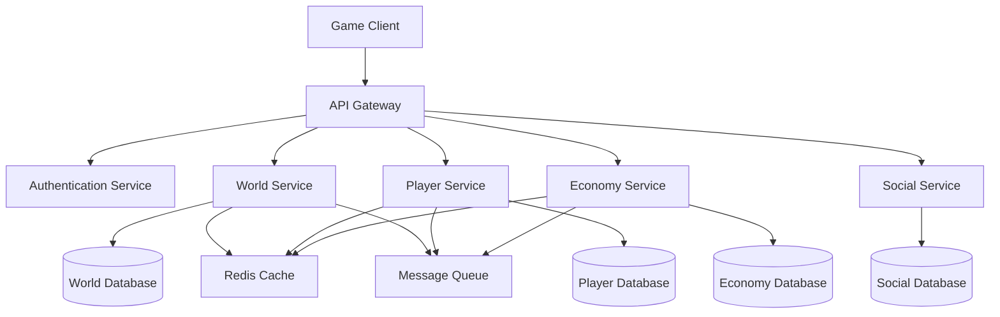
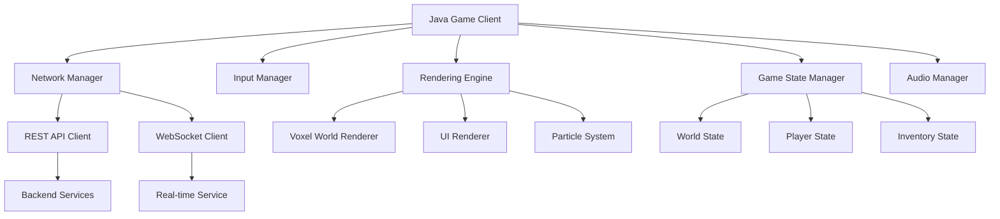

# Skybound Realms - Technical Design Document

## Overview

Skybound Realms is a sandbox MMORPG built on a client-server architecture supporting thousands of concurrent players across persistent private islands and shared public zones. The system uses a microservices approach with dedicated services for world management, player progression, economy, and real-time multiplayer interactions.

## Architecture

### High-Level Architecture



### Service Architecture

- **API Gateway**: Routes requests, handles load balancing, and manages authentication
- **World Service**: Manages island instances, public zones, and voxel world state
- **Player Service**: Handles character progression, skills, inventory, and minions
- **Economy Service**: Manages auction house, trading, and market dynamics
- **Social Service**: Handles guilds, chat, friends, and cooperative features
- **Real-time Service**: WebSocket connections for live multiplayer interactions

## Components and Interfaces

### World Management System

#### Island Instance Manager
```typescript
interface IslandInstance {
  playerId: string;
  worldData: VoxelChunk[];
  lastModified: Date;
  expansionLevel: number;
  activeMinions: Minion[];
}

interface WorldService {
  loadPlayerIsland(playerId: string): Promise<IslandInstance>;
  saveIslandChanges(playerId: string, changes: VoxelChange[]): Promise<void>;
  expandIsland(playerId: string, blueprint: IslandBlueprint): Promise<boolean>;
  getPublicZone(zoneId: string): Promise<PublicZone>;
}
```

#### Voxel Engine Integration
- **Chunk System**: 16x16x16 voxel chunks for efficient loading/unloading
- **Streaming**: Dynamic loading of chunks based on player proximity
- **Compression**: Run-length encoding for sparse voxel data
- **Physics**: Collision detection and block placement validation

### Player Progression System

#### Skill Management
```typescript
interface SkillSystem {
  skills: Map<SkillType, SkillData>;
  addExperience(skill: SkillType, amount: number): SkillLevelResult;
  getSkillLevel(skill: SkillType): number;
  getActivePerks(skill: SkillType): Perk[];
  prestigeSkill(skill: SkillType): Promise<boolean>;
}

interface SkillData {
  experience: number;
  level: number;
  prestige: number;
  unlockedPerks: string[];
}
```

#### Inventory and Item Management
```typescript
interface ItemStack {
  itemId: string;
  quantity: number;
  metadata?: ItemMetadata;
}

interface ItemMetadata {
  rarity: ItemRarity;
  enchantments: Enchantment[];
  durability?: number;
  reforgeStats?: StatModifiers;
}
```

### Combat and Dungeon System

#### Dungeon Generation
```typescript
interface DungeonGenerator {
  generateDungeon(difficulty: number, partySize: number): Dungeon;
  populateMobs(dungeon: Dungeon, difficulty: number): void;
  placeLoot(dungeon: Dungeon, rarity: LootTable): void;
}

interface Dungeon {
  layout: DungeonRoom[];
  mobs: MobSpawn[];
  lootChests: LootChest[];
  bossRoom: BossEncounter;
}
```

#### Combat Mechanics
- **Turn-based with real-time elements**: Actions have cooldowns and casting times
- **Damage calculation**: Base damage + weapon stats + skill bonuses + enchantments
- **Status effects**: Buffs, debuffs, and damage over time
- **Group mechanics**: Aggro management, healing, and combo attacks

### Economy System

#### Market Dynamics
```typescript
interface MarketService {
  listItem(sellerId: string, item: ItemStack, price: number): Promise<string>;
  purchaseItem(buyerId: string, listingId: string): Promise<TransactionResult>;
  getMarketPrices(itemId: string): Promise<PriceHistory>;
  updateMarketTrends(): Promise<void>;
}

interface AuctionHouse {
  activeListings: Map<string, Listing>;
  completedSales: TransactionHistory[];
  priceIndex: Map<string, PriceData>;
}
```

#### Currency and Trading
- **Primary Currency**: Coins earned through gameplay activities
- **Secondary Currencies**: Dungeon tokens, event currencies, guild points
- **Trading System**: Secure player-to-player trading with confirmation steps
- **Tax System**: Market fees to control inflation

### Minion Automation System

#### Minion Management
```typescript
interface MinionSystem {
  deployMinion(playerId: string, minionType: string, location: Vector3): Promise<boolean>;
  upgradeMinion(minionId: string, upgradeType: string): Promise<boolean>;
  collectResources(minionId: string): Promise<ItemStack[]>;
  getMinionStatus(minionId: string): MinionStatus;
}

interface MinionStatus {
  isActive: boolean;
  resourcesCollected: ItemStack[];
  storageCapacity: number;
  efficiency: number;
  timeUntilNextCollection: number;
}
```

#### Offline Processing
- **Background Jobs**: Scheduled tasks process minion activities every 5 minutes
- **Catch-up Mechanics**: Calculate offline progress when players return
- **Storage Limits**: Prevent infinite resource accumulation
- **Efficiency Scaling**: Diminishing returns for multiple minions of same type

## Data Models

### Player Data Model
```typescript
interface Player {
  id: string;
  username: string;
  islandId: string;
  skills: Map<SkillType, SkillData>;
  inventory: ItemStack[];
  equipment: EquipmentSlots;
  currency: CurrencyAmounts;
  minions: Minion[];
  guildId?: string;
  friends: string[];
  settings: PlayerSettings;
  lastLogin: Date;
}
```

### World Data Model
```typescript
interface WorldChunk {
  chunkId: string;
  position: ChunkCoordinate;
  voxelData: Uint8Array; // Compressed voxel data
  entities: Entity[];
  lastModified: Date;
}

interface Island {
  ownerId: string;
  chunks: WorldChunk[];
  expansionLevel: number;
  permissions: IslandPermissions;
  visitCount: number;
}
```

### Economy Data Model
```typescript
interface MarketListing {
  id: string;
  sellerId: string;
  item: ItemStack;
  price: number;
  listedAt: Date;
  expiresAt: Date;
  category: ItemCategory;
}

interface Transaction {
  id: string;
  buyerId: string;
  sellerId: string;
  item: ItemStack;
  price: number;
  timestamp: Date;
  marketFee: number;
}
```

## Error Handling

### Client-Side Error Handling
- **Connection Loss**: Automatic reconnection with exponential backoff
- **Desync Detection**: Periodic state validation between client and server
- **Input Validation**: Client-side validation with server-side verification
- **Graceful Degradation**: Offline mode for single-player island activities

### Server-Side Error Handling
- **Database Failures**: Automatic failover to read replicas
- **Service Unavailability**: Circuit breaker pattern with fallback responses
- **Data Corruption**: Checksums and backup validation
- **Load Balancing**: Automatic scaling based on player count and resource usage

### Data Consistency
- **Transaction Management**: ACID compliance for critical operations (trades, purchases)
- **Eventual Consistency**: Non-critical data (leaderboards, statistics) can have slight delays
- **Conflict Resolution**: Last-write-wins for island modifications with change logs
- **Backup Strategy**: Hourly incremental backups with daily full backups

## Testing Strategy

### Unit Testing
- **Service Layer**: Mock external dependencies, test business logic
- **Data Layer**: In-memory database for repository testing
- **Game Logic**: Isolated testing of combat calculations, skill progression
- **Coverage Target**: 80% code coverage for critical systems

### Integration Testing
- **API Endpoints**: Full request/response cycle testing
- **Database Operations**: Test data persistence and retrieval
- **Service Communication**: Inter-service messaging and error handling
- **Real-time Features**: WebSocket connection and message delivery

### Performance Testing
- **Load Testing**: Simulate 1000+ concurrent players
- **Stress Testing**: Push system beyond normal capacity
- **Endurance Testing**: 24-hour continuous operation
- **Database Performance**: Query optimization and indexing validation

### Game-Specific Testing
- **Balance Testing**: Automated simulation of progression curves
- **Economy Testing**: Market manipulation and inflation scenarios
- **Exploit Testing**: Duplication bugs, infinite resource generation
- **Multiplayer Testing**: Race conditions, synchronization issues

### Deployment Testing
- **Blue-Green Deployment**: Zero-downtime updates
- **Rollback Procedures**: Quick reversion for critical issues
- **Database Migration**: Schema changes with backward compatibility
- **Configuration Management**: Environment-specific settings validation

## Java Game Client

### Client Architecture Overview

The Java game client provides a rich desktop gaming experience that connects to the backend services through REST APIs and WebSocket connections. Built using modern Java frameworks and game development libraries, it handles rendering, user input, game state management, and real-time multiplayer interactions.



### Core Client Components

#### Game Engine Foundation
```java
public class GameEngine {
    private RenderEngine renderEngine;
    private InputManager inputManager;
    private NetworkManager networkManager;
    private GameStateManager stateManager;
    private AudioManager audioManager;
    
    public void initialize();
    public void gameLoop();
    public void shutdown();
}

public interface GameState {
    void enter();
    void update(float deltaTime);
    void render();
    void exit();
}
```

#### Network Communication Layer
```java
public class NetworkManager {
    private ApiClient apiClient;
    private WebSocketClient wsClient;
    private ConnectionManager connectionManager;
    
    public CompletableFuture<ApiResponse> sendRequest(ApiRequest request);
    public void subscribeToRealtimeEvents(EventHandler handler);
    public void handleConnectionLoss();
}

public class ApiClient {
    public CompletableFuture<Player> getPlayerData(String playerId);
    public CompletableFuture<Island> loadPlayerIsland(String playerId);
    public CompletableFuture<Void> saveIslandChanges(List<VoxelChange> changes);
    public CompletableFuture<List<MarketListing>> getMarketListings(String category);
}
```

#### Voxel World Rendering
```java
public class VoxelRenderer {
    private ChunkManager chunkManager;
    private MeshGenerator meshGenerator;
    private TextureAtlas blockTextures;
    
    public void renderWorld(Camera camera, WorldState worldState);
    public void updateChunk(ChunkCoordinate coord, VoxelData data);
    public void generateMesh(Chunk chunk);
}

public class ChunkManager {
    private Map<ChunkCoordinate, Chunk> loadedChunks;
    private Queue<ChunkCoordinate> loadQueue;
    
    public void loadChunksAroundPlayer(Vector3 playerPosition);
    public void unloadDistantChunks(Vector3 playerPosition);
    public Chunk getChunk(ChunkCoordinate coord);
}
```

#### User Interface System
```java
public class UIManager {
    private InventoryUI inventoryUI;
    private ChatUI chatUI;
    private SkillsUI skillsUI;
    private MarketUI marketUI;
    private SettingsUI settingsUI;
    
    public void renderUI();
    public void handleUIInput(InputEvent event);
    public void showDialog(DialogType type, Object data);
}

public class InventoryUI extends UIComponent {
    public void displayItems(List<ItemStack> items);
    public void handleItemClick(ItemStack item, ClickType clickType);
    public void updateItemTooltip(ItemStack item);
}
```

### Game State Management

#### World State Synchronization
```java
public class WorldStateManager {
    private Island playerIsland;
    private PublicZone currentZone;
    private Map<String, Player> nearbyPlayers;
    
    public void syncWithServer();
    public void applyVoxelChanges(List<VoxelChange> changes);
    public void handlePlayerMovement(String playerId, Vector3 position);
}

public class PlayerStateManager {
    private Player localPlayer;
    private Skills skills;
    private Inventory inventory;
    private Equipment equipment;
    
    public void updatePlayerStats(PlayerStats stats);
    public void addExperience(SkillType skill, int amount);
    public void updateInventory(List<ItemStack> items);
}
```

#### Input and Controls
```java
public class InputManager {
    private KeyBindings keyBindings;
    private MouseHandler mouseHandler;
    private GamepadHandler gamepadHandler;
    
    public void processInput();
    public void handleKeyPress(KeyEvent event);
    public void handleMouseClick(MouseEvent event);
    public void handleGamepadInput(GamepadEvent event);
}

public class PlayerController {
    public void movePlayer(Vector3 direction);
    public void placeBlock(Vector3 position, BlockType blockType);
    public void breakBlock(Vector3 position);
    public void interactWithObject(GameObject object);
}
```

### Real-time Multiplayer Features

#### WebSocket Event Handling
```java
public class RealtimeEventHandler {
    public void onPlayerJoined(PlayerJoinedEvent event);
    public void onPlayerLeft(PlayerLeftEvent event);
    public void onPlayerMoved(PlayerMovedEvent event);
    public void onBlockChanged(BlockChangedEvent event);
    public void onChatMessage(ChatMessageEvent event);
}

public class MultiplayerManager {
    private Map<String, RemotePlayer> remotePlayers;
    private ChatManager chatManager;
    
    public void updateRemotePlayer(String playerId, PlayerUpdate update);
    public void sendChatMessage(String message, ChatChannel channel);
    public void handlePlayerInteraction(String playerId, InteractionType type);
}
```

### Client-Side Game Logic

#### Combat System Client
```java
public class CombatManager {
    private CombatState currentCombat;
    private SkillCooldowns cooldowns;
    
    public void startCombat(List<Entity> participants);
    public void executeAction(CombatAction action);
    public void updateCombatState(CombatUpdate update);
    public void endCombat(CombatResult result);
}

public class SkillSystem {
    private Map<SkillType, Skill> skills;
    private SkillTreeUI skillTreeUI;
    
    public void useSkill(SkillType skillType, Vector3 target);
    public void upgradeSkill(SkillType skillType);
    public boolean canUseSkill(SkillType skillType);
}
```

#### Economy and Trading Client
```java
public class MarketManager {
    private MarketUI marketUI;
    private List<MarketListing> currentListings;
    
    public void openMarket();
    public void searchItems(String query, ItemCategory category);
    public void purchaseItem(String listingId);
    public void listItem(ItemStack item, int price);
}

public class TradingManager {
    private TradeWindow tradeWindow;
    private TradeOffer currentOffer;
    
    public void initiateTradeWith(String playerId);
    public void addItemToTrade(ItemStack item);
    public void confirmTrade();
    public void cancelTrade();
}
```

### Client Configuration and Settings

#### Graphics Settings
```java
public class GraphicsSettings {
    private int renderDistance;
    private boolean enableShadows;
    private boolean enableParticles;
    private int textureQuality;
    private boolean enableVSync;
    
    public void applySettings();
    public void saveSettings();
    public void loadSettings();
}

public class PerformanceManager {
    private FPSCounter fpsCounter;
    private MemoryMonitor memoryMonitor;
    
    public void optimizePerformance();
    public void adjustQualityBasedOnPerformance();
    public PerformanceMetrics getMetrics();
}
```

### Client-Side Data Management

#### Local Caching
```java
public class ClientCache {
    private Map<String, CachedData> cache;
    private long maxCacheSize;
    
    public void cachePlayerData(String playerId, Player player);
    public void cacheWorldChunk(ChunkCoordinate coord, Chunk chunk);
    public void invalidateCache(String key);
    public void clearExpiredEntries();
}

public class OfflineDataManager {
    public void saveOfflineProgress();
    public void syncOfflineChanges();
    public boolean canPlayOffline();
}
```

### Client Testing Strategy

#### Unit Testing for Client
- **Game Logic Testing**: Combat calculations, skill progression, inventory management
- **Network Layer Testing**: API client mocking, WebSocket event handling
- **UI Component Testing**: User interface interactions and state updates
- **Performance Testing**: Frame rate consistency, memory usage optimization

#### Integration Testing
- **Client-Server Integration**: Full gameplay scenarios with backend services
- **Real-time Features**: Multiplayer interactions, chat, trading
- **Cross-platform Testing**: Different operating systems and hardware configurations
- **Network Conditions**: Testing under various latency and bandwidth conditions